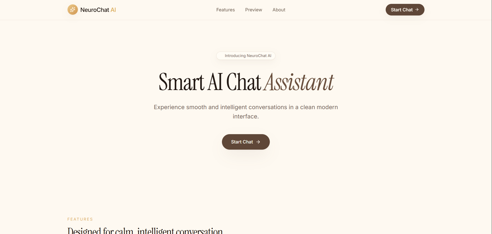
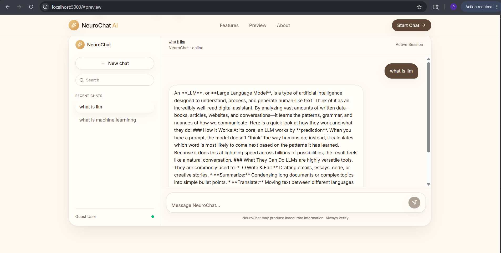
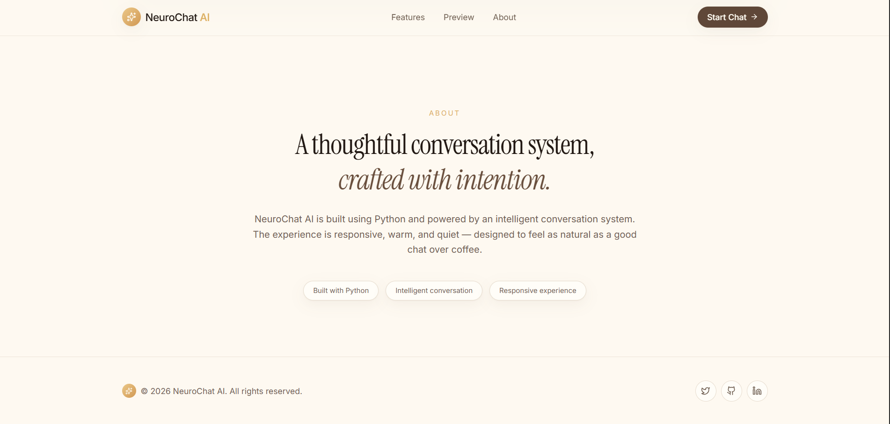

# 🧠 NeuroChat AI — Luxurious MERN Chatbot with Google Gemini

NeuroChat AI is a state-of-the-art, professionally designed, full-stack chatbot application featuring a futuristic luxury glassmorphism dashboard, persistent conversation histories, and an advanced, self-healing Google Gemini AI connection. 

This repository has been professionally organized and optimized for portfolio presentation and internship submission at **CODSOFT**.

---

## 📸 Screenshots Showcase

Here are screenshots showing the stunning layout and seamless AI responses:

| 🎨 Modern Landing Page & Guest Mode | 💬 Intelligent Sequential Chatting |
|---|---|
|  |  |

| ⚙️ Responsive Layout and Database Syncing | 🛠️ Server Launch Verification |
|---|---|
|  |  |

---

## 🌟 Key Features

*   **✨ Elite Glassmorphic UI**: High-end user interface built using modern typography, sleek gradients, responsive layouts, hover elements, and interactive components.
*   **🤖 Google Gemini AI REST API**: Context-aware sequential responses via direct HTTPS requests to Gemini Flash.
*   **🛡️ Multi-tier Failover Service**: Built-in self-healing model selector (`gemini-flash-latest` -> `gemini-2.0-flash` -> `gemini-1.5-flash-8b`) preventing quota exhaustion crashes.
*   **💾 Database Integration (Mongoose)**: Secure persistent storage for users, conversations, and sequential chat history.
*   **👥 Seamless Guest Authentication**: Instant silent guest signup so that persistent cloud chatting works immediately without tedious registration forms.
*   **⚡ Unified Reverse Proxy (Port 5000)**: Serves both frontend components and API endpoints under a single port, fully eliminating CORS and Cookie issues.
*   **🧹 Smart Viewport Scroll**: Static viewport rendering with reactive, scroll-controlled inner containers to prevent jumping.

---

## 🛠️ Tech Stack

### Frontend
- **Framework**: React 19 (TypeScript)
- **Bundler & Server**: Vite 7
- **Routing & State**: TanStack Start & React Query
- **Styling**: Modern Vanilla CSS, TailwindCSS, & Class Variance Authority
- **Icons**: Lucide React
- **Animations**: Tailwind-animate-css & custom CSS transitions

### Backend
- **Runtime**: Node.js
- **Framework**: Express.js
- **Database ORM**: Mongoose (MongoDB Atlas / Local MongoDB)
- **Security**: Helmet, Express Rate Limiter, and CORS configuration
- **Logging**: Morgan
- **Services**: Axios (REST AI service connection)

---

## 📂 Project Directory Structure

```text
CODSOFT/
└── chatbot/
     ├── frontend/         # React, Vite, TanStack client app
     ├── backend/          # Express API server & Gemini service
     ├── screenshots/      # Image assets for repository documentation
     ├── README.md         # Professional documentation
     └── .gitignore        # Version control exclude rules
```

---

## ⚙️ Environment Configuration

Create a `.env` file inside the `CODSOFT/chatbot/backend/` folder and insert your credentials:

```ini
PORT=5000
MONGO_URI=mongodb://127.0.0.1:27017/neurochat
JWT_SECRET=super_secret_jwt_key_for_neurochat
GEMINI_API_KEY=your_gemini_api_key_here
NODE_ENV=development
```

---

## 🚀 Installation & Local Running

Follow these simple steps to run the complete full-stack project locally:

### Prerequisites
Make sure you have [Node.js](https://nodejs.org/) installed (v18+ recommended) and a running instance of MongoDB.

### Step 1: Install Backend Dependencies
Navigate to the `backend` folder and install:
```bash
cd CODSOFT/chatbot/backend
npm install
```

### Step 2: Install Frontend Dependencies
Navigate to the `frontend` folder and install:
```bash
cd ../frontend
npm install
```

### Step 3: Start the Application

To run the unified full-stack application, we leverage our backend proxy:

1. **Start the Frontend Dev Server** (launches Vite on `http://localhost:8080` in silent mode):
   ```bash
   cd CODSOFT/chatbot/frontend
   npm run dev
   ```

2. **Start the Backend Express Server** (launches Express on `http://localhost:5000`):
   ```bash
   cd CODSOFT/chatbot/backend
   npm run dev
   ```

3. **Enjoy NeuroChat AI**:
   Open **[http://localhost:5000](http://localhost:5000)** in your web browser. The Express backend serves as a reverse proxy, mapping all web components and backend API endpoints dynamically under a single port!

---

## 🎨 Production & Deployment Recommendations

To deploy this project to production:
1. Run `npm run build` in the `frontend/` folder. This will output static files into the `dist/` directory.
2. Update the backend `server.js` file to serve the static frontend assets directly in production mode:
   ```javascript
   if (process.env.NODE_ENV === 'production') {
     app.use(express.static(path.join(__dirname, '../frontend/dist')));
     app.get('*', (req, res) => {
       res.sendFile(path.resolve(__dirname, '../frontend', 'dist', 'index.html'));
     });
   }
   ```
3. Deploy the Express server to hosting providers like Render, Heroku, or AWS, and host the MongoDB database using MongoDB Atlas cloud.
