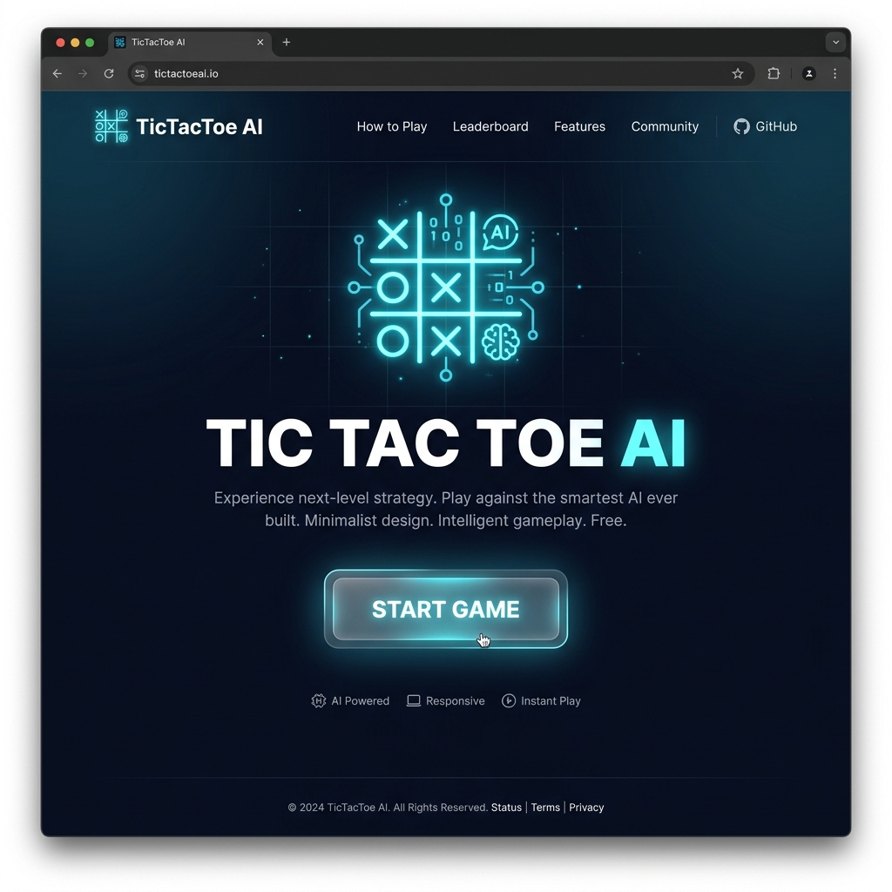
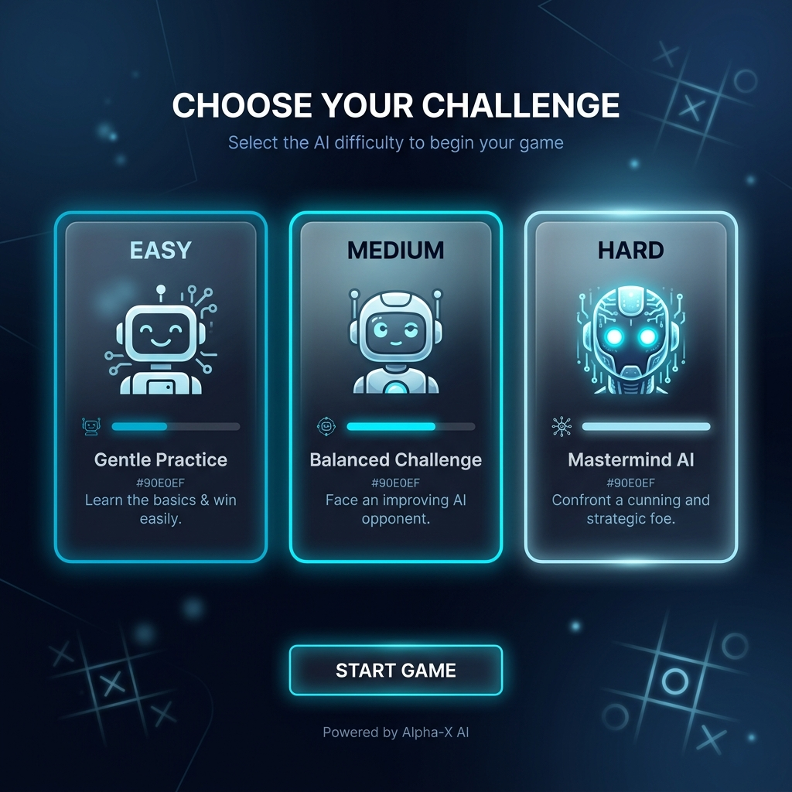
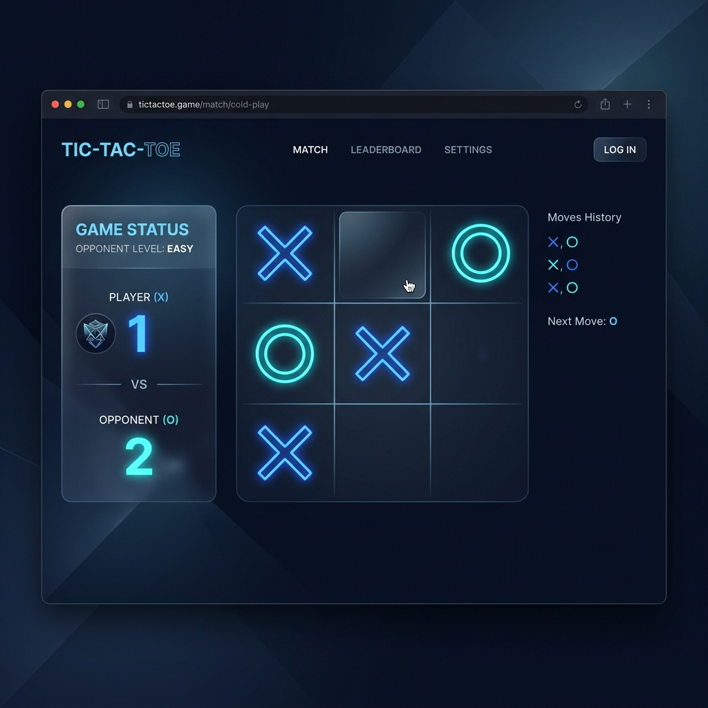
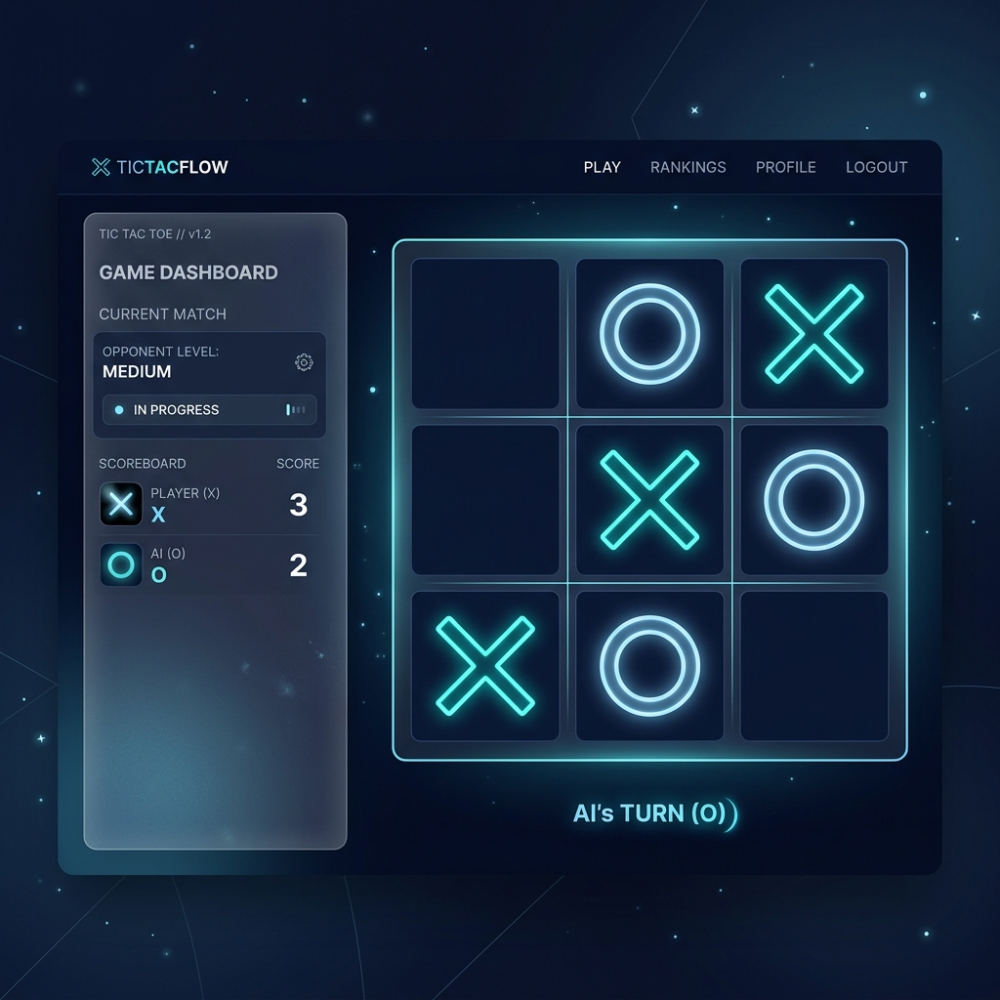
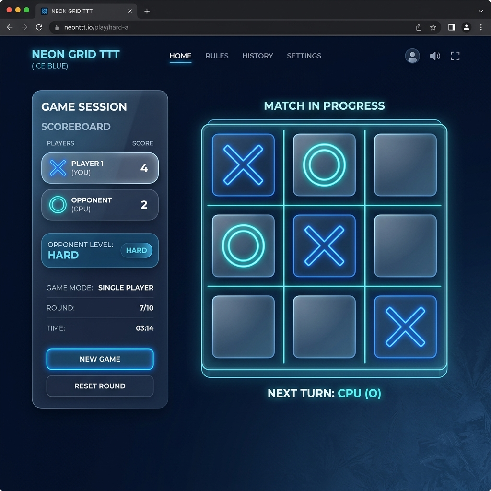
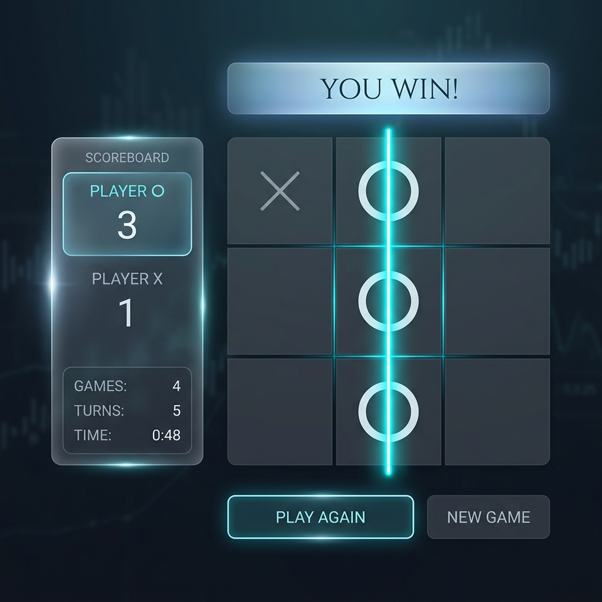
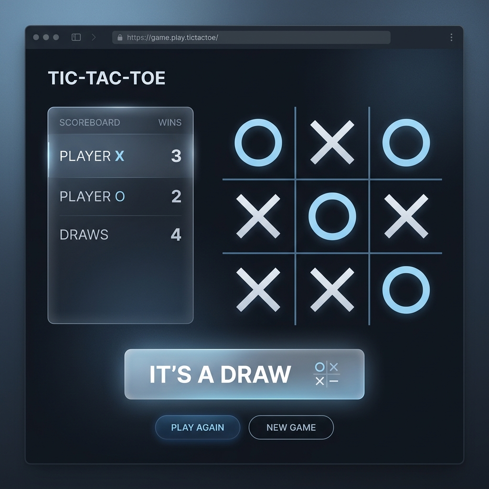

# AI Powered Tic-Tac-Toe Game

### Internship Task 2 - CodSoft

---

## Overview

This project is an AI-powered Tic-Tac-Toe game developed as part of the CodSoft Artificial Intelligence Internship Program. The application allows users to play against an intelligent AI opponent across multiple difficulty levels. The Hard mode uses the Minimax Algorithm, enabling the AI to make optimal decisions and remain unbeatable.

---

## Features

- **Human vs AI Gameplay**: Test your strategies against a computer-controlled player.
- **Three Difficulty Levels**:
  - **Easy**: Beginner-friendly opponent that makes random decisions and occasional mistakes.
  - **Medium**: Tactical defender that plays defensively and seeks immediate victories, with a slight margin of error.
  - **Hard**: Flawless, unbeatable opponent powered by depth-first state search.
- **Unbeatable AI using Minimax Algorithm**: A decision-making engine that calculates optimal moves recursively.
- **Modern Premium User Interface**: High-end startup-style minimalist design inspired by Linear, Apple, and Vercel.
- **Smooth Animations and Transitions**: Dynamic screen changes, custom drawing strokes for symbols, and button actions.
- **Responsive Design**: Adapts gracefully across mobile, tablet, and desktop monitors.
- **Real-Time Win Detection**: Instant parsing of win lines with glowing neon visual tracks.
- **Draw Detection**: Instant notification of full boards without a winner.
- **Score Tracking System**: Persistent round scores for Player, Draws, and AI.
- **Restart and Menu Navigation**: Instantly restart rounds or step back to the difficulty screen.
- **Cold-Themed Glassmorphism Design**: Frosted glass containers overlayed on a responsive interactive canvas particle network.

---

## Technologies Used

- **HTML5**: Semantic web structure and crisp inline SVG components.
- **CSS3**: Variables, fluid layouts, keyframes, transitions, and glassmorphic backdrop filters.
- **Vanilla JavaScript (ES6+)**: Custom particle physics loop, AI Minimax recursive heuristics, and state machine handlers.
- **Minimax Algorithm**: Evaluates grid permutations for infallible strategy.
- **Responsive Web Design**: Elastic dimensions and collapsing layouts.

---

## AI Strategy

The **Hard Mode** is powered by the **Minimax Algorithm**. This algorithm evaluates all possible future game states and selects the optimal move to maximize the AI's chances of winning while minimizing the opponent's opportunities. 

It assigns scores based on recursion depth:
* AI Win: `+10 - depth` (prefers faster wins)
* Human Win: `depth - 10` (staves off defeat as long as possible)
* Draw: `0`

---

## Difficulty Levels

### Easy
AI selects random available positions (60% probability) and performs basic blocks/wins 40% of the time.

### Medium
AI combines strategic decision-making (immediate winning paths, blocking opponent double-in-a-rows, prioritizing centers/corners) with occasional random moves.

### Hard
AI uses the Minimax Algorithm and cannot be defeated when implemented correctly.

---

## Project Structure

```text
Task2_TicTacToe_AI/
├── index.html
├── style.css
├── script.js
├── README.md
├── assets/
└── screenshots/
    ├── landing-page.png
    ├── difficulty-selection.png
    ├── easy-mode.png
    ├── medium-mode.png
    ├── hard-mode.png
    ├── winning-state.png
    └── draw-state.png
```

---

## Screenshots

### Landing Page


### Difficulty Selection


### Easy Mode


### Medium Mode


### Hard Mode


### Winning State


### Draw State


---

## Learning Outcomes

- **Artificial Intelligence Fundamentals**: Designing adaptive game states.
- **Game Theory Concepts**: Implementing zero-sum games with optimal turn trees.
- **Search Algorithms**: Recursive depth-first game tree traversal.
- **Minimax Algorithm Implementation**: Pruning terminal scores based on path depth.
- **Decision Making Systems**: Modeling rule-based systems.
- **Frontend Development**: Creating premium interfaces using modern web styling tokens.
- **JavaScript Logic Building**: Event bindings, SVG drawing paths, and animation states.

---

## Internship Information

* **Task**: AI Powered Tic-Tac-Toe Game
* **Organization**: CodSoft
* **Domain**: Artificial Intelligence
* **Status**: Completed
