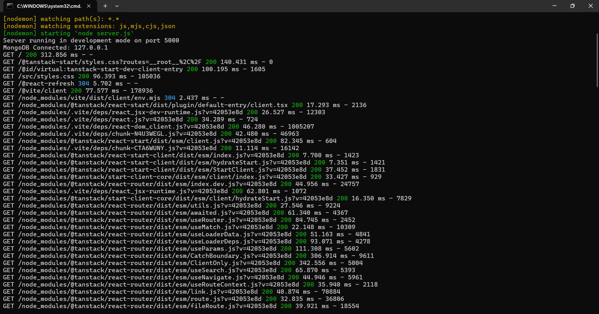

# 🧠 Rule-Based Chatbot (Frontend Only)

This project is a simple, professionally styled rule-based chatbot built using HTML, CSS, and JavaScript (React/Vite). It uses simple conditional logic (`if-else` / pattern matching) to generate response replies entirely on the client-side, without any external API calls, credentials, or backend server dependencies.

---

## 📸 Screenshots Showcase

Here are screenshots showing the stunning layout and seamless offline rule-based responses:

| 🎨 Modern Landing Page | 💬 Predefined Logical Conversing |
|---|---|
|  |  |

| ⚙️ Responsive Layout and Browser Storage | 🛠️ Server Launch Verification |
|---|---|
|  |  |

---

## 🌟 Features

- **💬 Rule-Based Conversational Chatbot**: Uses simple logical rules to match greeting cues, identity statements, and help requests to standard, predefined responses.
- **🔌 Zero API or Backend Dependency**: Runs 100% offline in your web browser with zero API keys, network traffic, database instances, or server processes.
- **💾 Local Browser Persistence**: Stores conversation lists and thread messages in `localStorage`, maintaining complete session capabilities (creation, deletion, sidebar lists) offline.
- **📚 Beginner-Friendly NLP Concept**: Clear code structure demonstrating basic natural language processing concepts using simple string matching rules.
- **🎨 Clean & Responsive UI**: Luxurious glassmorphism dashboard layout built with sleek typography and responsive panels.

---

## 🛠️ Technologies Used

- **HTML5**
- **CSS3** (TailwindCSS & Vanilla CSS)
- **JavaScript / TypeScript** (React 19 & Vite 7)
- **TanStack Start & Router**
- **Lucide Icons**

---

## ⚙️ How It Works

The chatbot processes user input using simple, predefined conditions:
1. When a message is sent, the input is trimmed and converted to lowercase.
2. A sequence of simple `if-else` conditions checks for keyword matches (such as greetings, support queries, or identity keywords).
3. If a match is found, the predefined response is returned and rendered with a slight delay to simulate a real typing indicator.
4. If no keywords match, it falls back to a default friendly error message.
5. All chats and messages are auto-saved directly inside the browser's `localStorage` for offline persistence.

---

## 🚀 Installation & Local Running

Follow these simple steps to run the frontend-only chatbot locally:

### Prerequisites
Make sure you have [Node.js](https://nodejs.org/) installed (v18+ recommended).

### Step 1: Install Dependencies
Navigate to the `frontend` folder and install:
```bash
cd chatbot/frontend
npm install
```

### Step 2: Start the Application
Run the local Vite development server:
```bash
npm run dev
```

### Step 3: Open the Website
Open **[http://localhost:8080](http://localhost:8080)** in your web browser. The entire application runs fully client-side on your computer!
